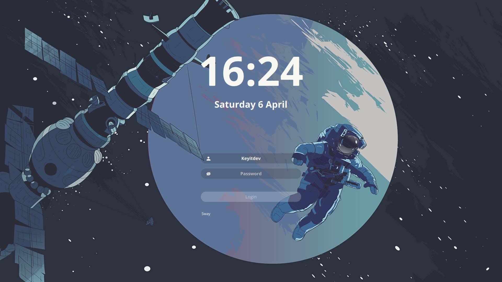
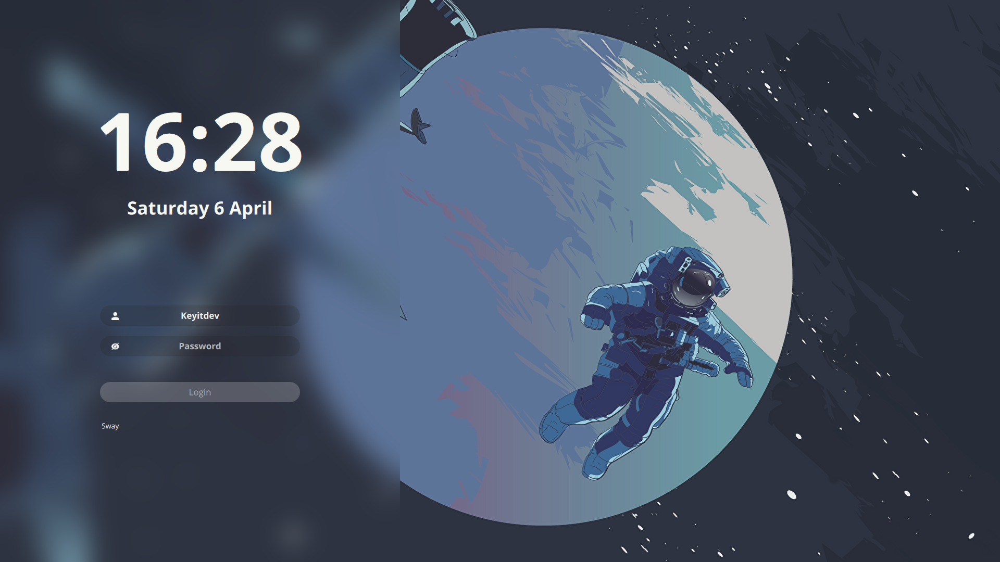

# sddm-astronaut-theme

A theme for the [SDDM login manager](https://github.com/sddm/sddm).

- Screen resolution: 1080p
- Font: Open sans

### Preview

You can easily change how it looks in **[config](./theme.conf)**. 
Here are some examples:






### Dependencies

#### Arch
```sh
sddm qt6-svg ttf-opensans
```

### Install

1. Clone this repository, copy fonts to `/usr/share/fonts/`:

   ```sh
   sudo git clone https://github.com/LittleYe233/sddm-yuri-maid-theme.git /usr/share/sddm/themes/sddm-yuri-maid-theme
   ```

2. Then edit `/usr/lib/sddm/sddm.conf.d/default.conf` (in Arch Linux for example), so that it looks like this:

    ```sh
    echo "[Theme]
    Current=sddm-yuri-maid-theme" | sudo tee /usr/lib/sddm/sddm.conf.d/default.conf
    ```


### Virtual keyboard


#### Arch
1. Install package.
    ```sh
    sddm qt6-virtualkeyboard
    ```

2. Then edit `/etc/sddm.conf.d/virtualkbd.conf`, so that it looks like this:

    ```sh
    [General]
    InputMethod=qtvirtualkeyboard
    ```

### Credits

Based on the theme [`Sugar Dark for SDDM`](https://github.com/MarianArlt/sddm-sugar-dark) by **MarianArlt**.

### License

Distributed under the **[GPLv3+](https://www.gnu.org/licenses/gpl-3.0.html) License**.    
Copyright (C) 2022-2024 Keyitdev.
